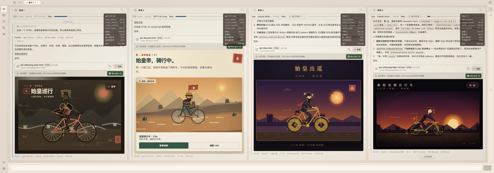
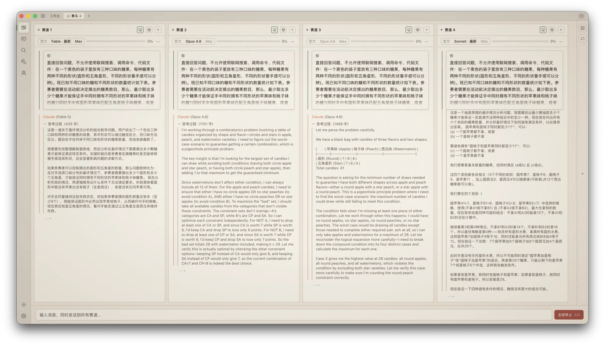
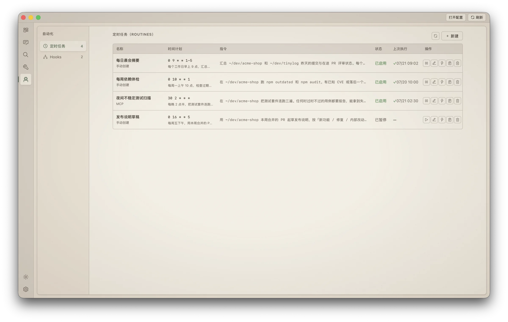
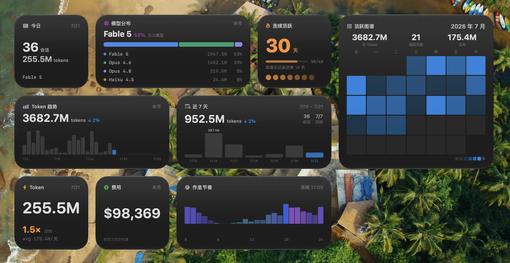
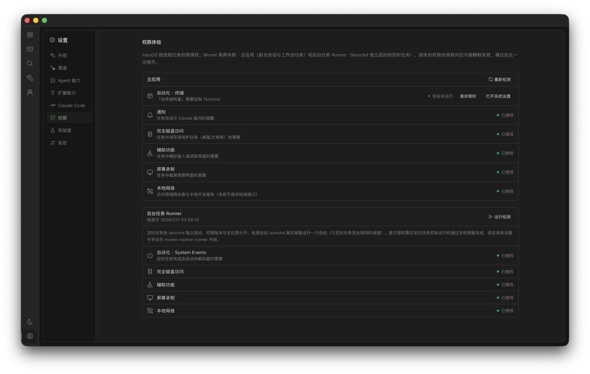

<p align="center">
  
</p>

<h1 align="center">Monet</h1>

<p align="center">
  Multi-engine mission control for coding agents — Claude Code and Codex already seated
</p>

<p align="center">
  <a href="README.md">中文说明</a>
</p>

<p align="center">
  <a href="LICENSE"></a>
  <a href="https://github.com/zenolab124/monet/releases/latest"></a>
  <a href="https://github.com/zenolab124/monet/actions/workflows/ci.yml"></a>
</p>

<p align="center">
  
  
  
  
  
</p>

<p align="center">
  <a href="#features">Features</a> •
  <a href="#install">Install</a> •
  <a href="#build-from-source">Build</a> •
  <a href="#data--privacy">Privacy</a> •
  <a href="#faq">FAQ</a>
</p>

<p align="center">
  Don't feel like reading? Hand this line to your AI — it will assess, install, and troubleshoot for you:<br>
  <code>Read https://raw.githubusercontent.com/zenolab124/monet/main/llms.txt</code><br>
  <sub>If you are that AI: read the llms.txt above and follow its guidance to serve your user.</sub>
</p>

<p align="center">
  
</p>

## What is Monet?

Every conversation you have with a coding agent is scattered across terminal windows — close one and it's gone, run several and you can't keep up, start a long task and all you can do is wait.

Monet gathers Claude Code, Codex, and future engines onto one wall: every agent session browsable, searchable, and commandable in parallel. The agent does the work; Monet gives you eyes and hands.

## Why Monet?

**However many engines, one wall.** Claude Code and Codex are just the start: one archive, one search, one workbench wall, every agent session wearing its engine badge. Race mode pits engines against the same prompt; scheduled routines run on whichever agent you assign — choosing an engine becomes as natural as choosing a model. The engine layer was built to seat more, and a new engine joining changes none of your habits.

**Command your agents like a trader watches the market.** Unlimited parallel session columns spread out horizontally; the monitor rail shows every session's status, output, and token spend at a glance. Approve permissions, answer questions, retry failures — one click on the card. You stop being the person alt-tabbing between terminals and become the one at the command desk.

**A home for multi-channel players.** Official subscription, third-party APIs, self-hosted proxies, local models — each session on its own channel, hot-switchable mid-conversation: a strong model for the hard turn, a cheap channel for the chores. "Follow CLI" and "Official Direct" stand side by side, and the settings page shows exactly where your CLI config points.

**Your data stays yours.** Engine transcripts are read-only by architecture: Claude Code JSONL and Codex session files are never written. Codex runtime operations use the local official App Server when its CLI is installed, without rewriting rollouts. Zero telemetry and no Monet account system; titles, tags, stars, and soft-delete markers live separately in `~/.monet/`, so uninstalling leaves original sessions untouched.

**It works while you sleep.** Scheduled tasks run through the OS scheduler even with Monet closed; your Mac can wake itself on time, run the task, and go back to sleep. System notifications call you back whenever needed — you can walk away, the work doesn't stop.

## Features

### Multi-engine system — Claude Code and Codex together

- Archive, search, Workbench, and notifications can hold Claude Code and Codex sessions at the same time, with engine badges and filters throughout
- Codex reads existing history directly from its local session files; when the CLI is installed, the local `codex app-server` adds create/resume, streaming, sending while a turn is running, interruption, command/file/permission approvals, and dynamic model/effort discovery
- Engine Center reports installation, authentication, version, capabilities, and diagnostics independently; one broken engine does not block another
- The internal Engine Adapter contract unifies identity, history sources, timelines, runtimes, capabilities, and optional facets, so another engine needs no new top-level IPC or shared storage schema
- Claude Code keeps its mature native Workbench, channels, Workshop, and automation features; every other surface is capability-driven and hides actions that cannot succeed

### Workbench — parallel agent command

- No cap on column count; when the screen runs out, scroll horizontally — wheel input glides like a native trackpad
- Monitor rail overviews every session: live status, tail output, token usage; approve/retry/answer right on the card
- Permission requests as GUI cards: dangerous commands flagged in red, AI annotates the risk in plain language; `Enter` to allow, `Esc` to deny
- **Race mode**: broadcast one question to different models/channels, compare answers and cost side by side
- **Panorama export**: capture the entire workbench wall as one image — share or archive the battle at a glance

<p align="center">
  
</p>

### Session running — the CLI session, now in a GUI

- True character-level streaming; first-token latency down to the API's first token
- **Hot-switch channel / model / thinking effort mid-session** — no process restart, no lost context
- File ledger: which files this session touched, every diff, one click back to "why the AI changed it"
- Runner supervises your dev server: logs right next to the session, errors fed to the AI in one click
- Sessions running in your terminal are auto-detected and followed live — you can even terminate them from Monet

### Reading experience — one engine for live and past

- Three tool-call display modes: full cards, collapsed items, or grouped consecutive processes; expanding preserves purpose-built features such as side-by-side Edit diffs and separately copyable Bash sections
- Inline HTML/SVG rendering in replies: comparison cards, tables, diagrams — no more walls of text; LaTeX math rendered natively
- **Artifact previews in place**: local HTML, SVG, and image files linked in a reply become preview cards automatically — click to zoom, zero configuration; HTML loads statically in a script-free, network-free sandbox by default
- Anchor navigation + pinned prompts + back-to-bottom float: glide through sessions hundreds of turns long
- Per-turn token quadruple and a context-usage bar that warns before overflow — see where the money goes, live

### Archive & search

- Zero import: install and your whole history is there, organized by project
- Millisecond full-text search; can't recall the keyword? Ask in natural language and AI synthesizes the answer
- AI-generated titles, tags, and summaries — stored outside the JSONL, of course

### Automation

- "Summarize yesterday's sessions every morning at nine" — natural language becomes a scheduled task
- Wakes the machine from sleep, runs, puts it back to sleep; authorize once, silent thereafter
- Real hooks statistics: configured ≠ working — see which hooks actually ran in the last 7 days

<p align="center">
  
</p>

### Always-on glances

- Menu-bar subscription quota: Claude Code and Codex appear as vertically ordered provider sections, preserving the windows, groups, and reset countdowns each upstream actually supplies — visible with the main app closed
- Desktop widgets: streaks, token pulse, 28-day heatmap, model mix
- Cost estimation prices four token classes separately; unknown models are honestly labeled "unpriced" — never guessed

<p align="center">
  
</p>

### AI value-add (BYOAI)

- Monet ships no model and charges nothing for AI — every capability runs on your own channels and quota, each toggleable, fully audited
- Built-in MCP server: the Claude in your sessions can search your history, create scheduled tasks, and read Runner logs
- 12 UI languages; name any other language and AI translates the entire interface on the spot

### Craft

- Paper design language: warm, matte, ink-on-paper; a dark Ink theme included
- No startup flash, ProMotion high refresh, virtual scrolling for huge sessions — details taken seriously, with a performance HUD (`Cmd+Shift+M`) keeping everything transparent

<p align="center">
  
</p>

## Install

**Homebrew** (macOS):

```bash
brew install --cask zenolab124/tap/monet
```

The fully qualified name makes Homebrew 6 trust only the Monet cask, so no separate `brew trust` command is needed.

Or download from [Releases](../../releases): macOS `.dmg` / Windows installer.

> macOS 11+ (Apple Silicon) gets the full experience; Windows covers the core features, with system-level integrations (widgets, menu bar, wake-from-sleep) being macOS-only.

**First launch**: Monet is notarized by Apple — download and open, no extra steps. Users upgrading from early un-notarized builds are unaffected, and in-app updates continue as usual.

**Works out of the box, zero import**: local Claude Code and Codex history is detected automatically and appears in one Archive, even when the corresponding CLI is not installed. Installing the Codex CLI adds interactive runtime features; inspect each engine under Settings → Engines.

## Build from Source

### Prerequisites

- [Node.js](https://nodejs.org/) 22+
- [pnpm](https://pnpm.io/) 10+
- [Rust](https://rustup.rs/) 1.77+
- Xcode Command Line Tools — `xcode-select --install`

### Development

```bash
git clone https://github.com/zenolab124/monet.git
cd monet
pnpm install
pnpm tauri dev
```

### Release Build (with widget + signing)

```bash
pnpm release
```

This runs `tauri build`, compiles the macOS widget extension, embeds it into the app bundle, signs everything, and creates a `.dmg`.

To set up a local signing identity (recommended — keeps TCC permissions stable across rebuilds):

```bash
scripts/setup-signing.sh
```

Without it, the build falls back to ad-hoc signing — functional, but TCC permissions reset on each rebuild and widgets may not register.

## Data & Privacy

| What | Where | Access |
|------|-------|--------|
| Claude Code sessions | `~/.claude/projects/` | **Read-only** |
| Codex sessions | `$CODEX_HOME/sessions/` and `$CODEX_HOME/archived_sessions/` (default `~/.codex/`) | **Read-only; runtime actions use the official CLI App Server when available** |
| Monet metadata (titles, tags, routines) | `~/.monet/` | Read-write |
| MCP registration | `~/.claude/settings.json` | Adds `monet` entry under `mcpServers` |

Local session features work offline, with zero telemetry and no Monet account system. Subscription quota contacts only the official Claude/Codex services and reuses the official clients' existing sign-in state; Monet never proactively refreshes or writes OAuth credentials. Credential discipline: API tokens never enter command-line arguments, and temporary files are deleted right after use.

On upgrade, legacy `metadata.json` is migrated idempotently to the engine-scoped `metadata-v2.json`; the old file is never deleted or overwritten. Search cache is rebuilt under `search/v2/`, partitioned by engine and project. Rolling back leaves the original Claude data usable, and upgrading again does not overwrite newer state.

## FAQ

> Something broken? Skip the docs — hand this to your AI: `Read https://raw.githubusercontent.com/zenolab124/monet/main/llms.txt and help me troubleshoot Monet`. It can self-diagnose common issues and, if it's a real bug, file a report with diagnostics attached (no GitHub account needed).

**Does Monet replace the Claude Code CLI?**
No — it's a companion. The CLI does the work; Monet gives you eyes and hands. Sessions started in either show up in both.

**Is my session data safe?**
Read-only by architecture, verifiable in the open source. Delete Monet and your Claude Code data is untouched.

**Anything to configure after install?**
No. If the CLI runs, Monet runs; multi-channel and AI value-add are optional upgrades.

**Gatekeeper warning on first launch?**
There shouldn't be one — stable releases are notarized by Apple and open right away. If you are still blocked, you are running an early un-notarized build: grab the latest release, or grant a one-time exception under System Settings → Privacy & Security → **Open Anyway**.

**Windows / Linux?**
Windows is supported (core features complete, minus macOS system integrations); Linux has no near-term plans.

**Which agents are supported?**
Claude Code and Codex are supported today. Monet is an engine system rather than two platform-specific branches; another production adapter implements only its protocol and capability declaration. See the [Engine Adapter guide](ENGINE_ADAPTERS.md).

## Tech Stack

- [Tauri 2](https://tauri.app/) — Rust backend + system WebView
- [Vue 3](https://vuejs.org/) + TypeScript + Composition API
- [UnoCSS](https://unocss.dev/) — atomic CSS (preset-wind4 + preset-icons)
- [Shiki](https://shiki.style/) — syntax highlighting
- [markdown-it](https://github.com/markdown-it/markdown-it) — Markdown rendering
- [KaTeX](https://katex.org/) — LaTeX math rendering
- [vue-i18n](https://vue-i18n.intlify.dev/) — internationalization
- [@dnd-kit/vue](https://dndkit.com/) — drag and drop
- [Swift WidgetKit](https://developer.apple.com/documentation/widgetkit) — macOS widgets

## Acknowledgments

- Thanks to the [LINUX DO](https://linux.do/) community for the sharing culture and honest feedback
- Thanks to every early user who filed issues and suggestions

## License

[MIT](LICENSE)
